# Entidad/Relación

## Instrucciones

Crea el modelo Entidad/Relación para los dos siguientes supuestos:

---

### Gestión de Cursos Universitarios

Una universidad desea gestionar la información sobre los cursos que ofrece, los estudiantes que los cursan y los profesores que los imparten.

- La universidad ofrece varios cursos.
- De cada curso se desea conocer:

  - Código del curso (único)
  - Nombre
  - Cantidad de créditos
  - Semestre en el que se ofrece

- Un estudiante puede inscribirse en varios cursos.
- De cada estudiante se desea registrar:

  - Matrícula (única)
  - Nombre
  - Apellido
  - Carrera
  - Correo electrónico

- Cada curso es impartido por uno o varios profesores.
- De cada profesor se registra:

  - ID (único)
  - Nombre
  - Especialidad
  - Correo electrónico

- Es necesario saber qué notas obtuvo cada estudiante en cada curso.

---

### Sistema de Reservas de Restaurantes

Un restaurante desea llevar el control de las mesas, los clientes y las reservas realizadas.

- El restaurante tiene varias mesas disponibles.
- De cada mesa se desea registrar:

  - Número de mesa (único)
  - Capacidad (número de personas)
  - Ubicación (por ejemplo: interior, terraza, etc.)

- Los clientes pueden realizar reservas para una o más mesas.
- De cada cliente se guarda:

  - DNI (único)
  - Nombre
  - Apellido
  - Teléfono

- Una reserva incluye:
  - El cliente que la realiza
  - Una o más mesas reservadas
  - La fecha y hora de la reserva
  - El número de personas que asistirán

